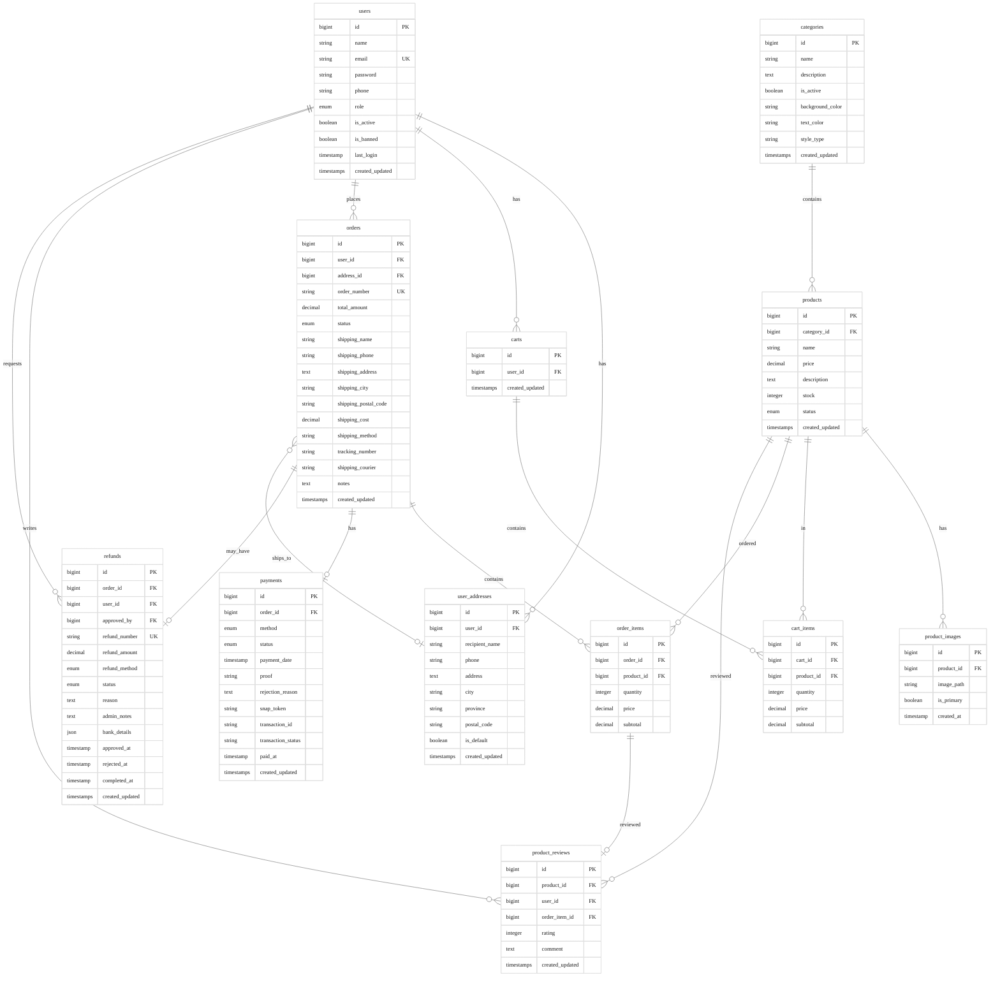

# TeoriWarna E-Commerce - Database Schema

## Entity Relationship Diagram

---

## Database Overview

**Total Tables:** 13  
**Total Relationships:** 16  
**Total Foreign Keys:** 17  
**Total Indexes:** 20

### Table Categories

**User Management** - users, user_addresses, carts, cart_items  
**Product Catalog** - categories, products, product_images, product_reviews  
**Order Processing** - orders, order_items, payments, refunds

---

## Enum Definitions

### users.role
`user` (default), `admin`, `super_admin`

### products.status
`active` (default), `inactive`, `archived`

### orders.status
`pending`, `paid`, `processing`, `shipped`, `completed`, `cancelled`, `refunded`

### payments.method
`transfer`, `ewallet`, `cod`

### payments.status
`pending` (default), `success`, `failed`

### refunds.refund_method
`bank_transfer`, `e_wallet`, `store_credit`

### refunds.status
`pending`, `approved`, `rejected`, `processing`, `completed`

---

## Key Relationships

### User Relations
Users have multiple addresses, carts, orders, and reviews. Users can request refunds, and admin users can approve refunds.

### Product Relations
Products belong to categories and can have multiple images, reviews, and be in carts or orders. All product-related data cascades on product deletion.

### Order Relations
Orders contain multiple items, have one payment record, and may have refund requests. Orders reference user addresses for shipping.

### Review Relations
Reviews are linked to specific order items (optional), ensuring only verified purchases can be reviewed.

---

## Indexing Strategy

**Performance Indexes:** Product status, category lookups, cart operations, order queries  
**Foreign Key Indexes:** All relationships properly indexed  
**Composite Indexes:** Product filtering (status + category), primary image selection

---

**System:** TeoriWarna E-Commerce  
**Database Version:** 1.0.0  
**Last Updated:** January 4, 2026