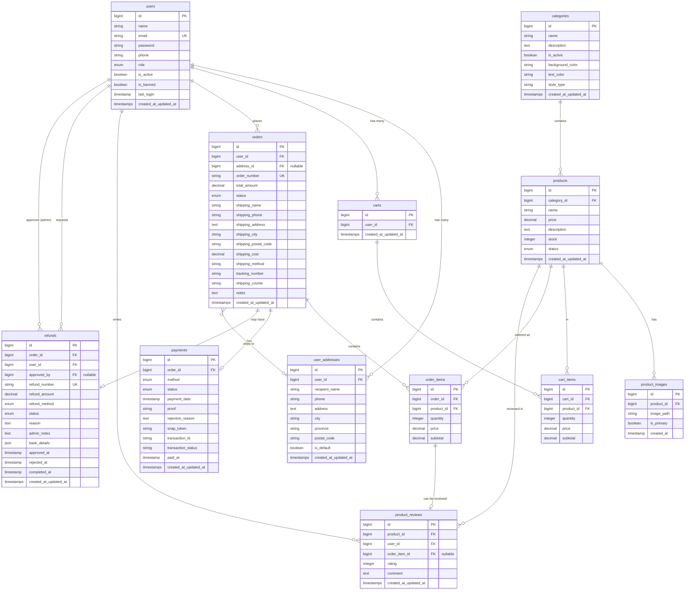

# TeoriWarna E-Commerce - Entity Relationship Diagram

## Database Entity Relationship Diagram (ERD)



---

## Database Statistics

### Total Tables: 13
- users
- user_addresses
- categories
- products
- product_images
- product_reviews
- carts
- cart_items
- orders
- order_items
- payments
- refunds
- store_settings

### Total Relationships: 18
- **One-to-Many:** 16 relationships
- **Optional One-to-One:** 2 relationships
- **Self-referencing:** 1 relationship (refunds.approved_by → users)

### Foreign Keys: 17
- All with proper CASCADE or SET NULL constraints
- All properly indexed for performance

### Indexes Summary:
- **Performance Indexes:** 11 (products, cart_items, order_items, product_images, orders, reviews)
- **Foreign Key Indexes:** 7 (carts, user_addresses, orders, payments, refunds)
- **Composite Indexes:** 2 (products.status+category_id, product_images.product_id+is_primary)
- **Total:** 20 indexes

---

## Table Details

### Core User Tables
- **users** - User accounts with authentication
- **user_addresses** - Shipping addresses for users
- **carts** - Shopping cart per user
- **cart_items** - Items in shopping cart

### Product Tables
- **categories** - Product categories
- **products** - Product catalog
- **product_images** - Product images (multiple per product)
- **product_reviews** - Customer reviews and ratings

### Order Tables
- **orders** - Customer orders
- **order_items** - Line items in orders
- **payments** - Payment records with Midtrans integration
- **refunds** - Refund requests and processing

### Configuration
- **store_settings** - Global store configuration

---

## Relationship Details

### Users Relationships
```
users (1) ─────── (many) user_addresses [CASCADE DELETE]
users (1) ─────── (many) carts [CASCADE DELETE]
users (1) ─────── (many) orders [CASCADE DELETE]
users (1) ─────── (many) product_reviews [CASCADE DELETE]
users (1) ─────── (many) refunds [CASCADE DELETE]
users (1) ─────── (many) refunds.approved_by [SET NULL - optional]
```

### Product Relationships
```
categories (1) ─────── (many) products [CASCADE DELETE]
products (1) ─────── (many) product_images [CASCADE DELETE]
products (1) ─────── (many) product_reviews [CASCADE DELETE]
products (1) ─────── (many) cart_items [CASCADE DELETE]
products (1) ─────── (many) order_items [CASCADE DELETE]
```

### Cart Relationships
```
carts (1) ─────── (many) cart_items [CASCADE DELETE]
```

### Order Relationships
```
orders (1) ─────── (many) order_items [CASCADE DELETE]
orders (1) ─────── (1) payments [CASCADE DELETE]
orders (1) ─────── (many) refunds [CASCADE DELETE]
orders (many) ─────── (1) user_addresses [SET NULL - optional]
```

### Review Relationships
```
order_items (1) ─────── (many) product_reviews [SET NULL - optional]
```

---

## Enum Values

### users.role
- `user` (default)
- `admin`
- `super_admin`

### products.status
- `active` (default)
- `inactive`
- `archived`

### orders.status
- `pending` (awaiting payment)
- `paid` (payment received)
- `processing` (being prepared)
- `shipped` (on delivery)
- `completed` (delivered)
- `cancelled` (cancelled by customer/admin)
- `refunded` (refund processed)

### payments.method
- `transfer` (bank transfer)
- `ewallet` (e-wallet: GoPay, OVO, DANA)
- `cod` (cash on delivery)

### payments.status
- `pending` (default)
- `success` (payment confirmed)
- `failed` (payment failed)

### refunds.refund_method
- `bank_transfer`
- `e_wallet`
- `store_credit`

### refunds.status
- `pending` (default)
- `approved`
- `rejected`
- `processing`
- `completed`

---

## Indexing Strategy

### Primary Indexes (Performance)
```
✅ products.category_id
✅ products.status
✅ products.(status, category_id) - composite
✅ cart_items.cart_id
✅ cart_items.product_id
✅ order_items.order_id
✅ order_items.product_id
✅ product_images.product_id
✅ product_images.(product_id, is_primary) - composite
✅ orders.user_id
✅ orders.status
✅ product_reviews.product_id
✅ product_reviews.user_id
```

### Foreign Key Indexes (Added)
```
✅ carts.user_id
✅ user_addresses.user_id
✅ orders.address_id
✅ payments.order_id
✅ refunds.order_id
✅ refunds.user_id
✅ refunds.approved_by
```

---

**Last Updated:** January 4, 2026
**Database Version:** After migration 2026_01_04_050000
**Total Indexes:** 20
**Total Foreign Keys:** 17
