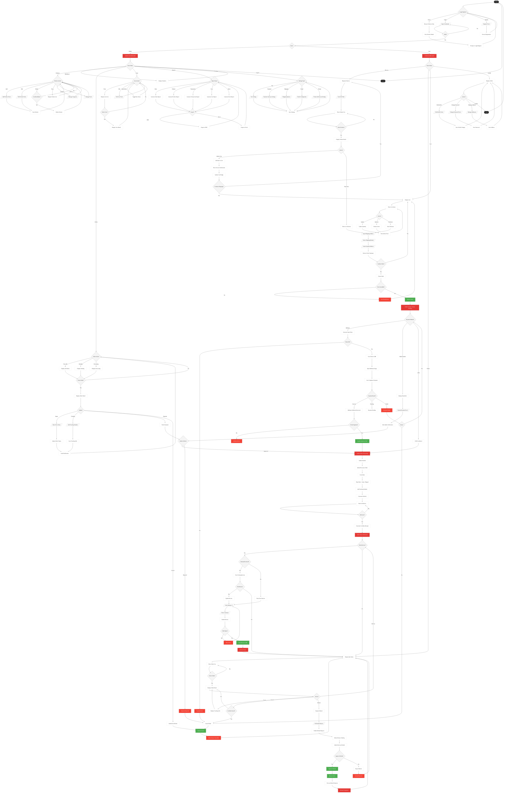

```mermaid
%%{init: {'theme':'base', 'themeVariables': { 'primaryColor':'#ffffff','primaryTextColor':'#1a1a1a','primaryBorderColor':'#e0e0e0','lineColor':'#757575','secondaryColor':'#fafafa','tertiaryColor':'#f5f5f5','background':'#ffffff','mainBkg':'#ffffff','secondaryBkgColor':'#fafafa','tertiaryBkgColor':'#f5f5f5','fontFamily':'Georgia, serif'}}}%%

flowchart TB
    Start([START])
    
    %% Authentication Flow
    Start --> Auth{Login/SignUp?}
    Auth -->|Guest| GuestBrowse[Browse Products Only]
    Auth -->|Login| Login[/Input Credentials/]
    Auth -->|SignUp| Register[/Register Form/]
    
    Register --> RegProcess[Process Registration]
    RegProcess --> Auth
    
    Login --> Validate{Valid?}
    Validate -->|No| Login
    Validate -->|Yes| CheckRole{Role?}
    
    CheckRole -->|Admin| Admin[ADMIN DASHBOARD]
    CheckRole -->|User| User[USER DASHBOARD]
    
    %% Guest Flow
    GuestBrowse --> GuestView[View Product Details]
    GuestView --> PromptLogin[Prompt to Login/Register]
    PromptLogin --> Auth
    
    %% User Dashboard
    User --> UserMenu{Select Menu}
    UserMenu -->|Browse| BrowseFlow
    UserMenu -->|Orders| OrderFlow
    UserMenu -->|Cart| CartFlow
    UserMenu -->|Profile| ProfileFlow
    
    %% Browse & Shopping Flow
    BrowseFlow[Display Products] --> SearchFilter[/Search & Filter/]
    SearchFilter --> ShowProducts[Show Product List]
    ShowProducts --> ClickProduct{Select Product?}
    ClickProduct -->|Yes| ProdDetail[Display Product Detail]
    ClickProduct -->|No| ShowProducts
    
    ProdDetail --> ProdAction{Action?}
    ProdAction -->|Add to Cart| AddToCartProcess
    ProdAction -->|Buy Now| DirectCheckout
    
    %% Cart Management
    AddToCartProcess[Add Item to Cart] --> CartNotif[Show Success Notification]
    CartNotif --> UpdateBadge[Update Cart Badge]
    UpdateBadge --> ContinueShopping{Continue Shopping?}
    ContinueShopping -->|Yes| BrowseFlow
    ContinueShopping -->|No| CartFlow
    
    CartFlow[Display Cart] --> CartItems[Show Cart Items]
    CartItems --> CartAction{Action?}
    CartAction -->|Update| UpdateQty[Update Quantity]
    CartAction -->|Remove| RemoveItem[Remove Item]
    CartAction -->|Checkout| CheckoutFlow
    
    UpdateQty --> RecalculateCart[Recalculate Total]
    RemoveItem --> RecalculateCart
    RecalculateCart --> CartItems
    
    %% Checkout Flow
    DirectCheckout[Direct to Checkout]
    CheckoutFlow[Start Checkout] --> ShipForm[/Input Shipping Address/]
    DirectCheckout --> ShipForm
    
    ShipForm --> SelectShip[/Select Shipping Method/]
    SelectShip --> SelectPay[/Select Payment Method/]
    SelectPay --> ReviewOrder[Review Order Summary]
    ReviewOrder --> ConfirmQ{Confirm Order?}
    
    ConfirmQ -->|No| CartFlow
    ConfirmQ -->|Yes| CreateOrder[Create Order]
    
    %% Stock Check
    CreateOrder --> CheckStock{Stock Available?}
    CheckStock -->|No| StockError[Stock Insufficient]
    CheckStock -->|Yes| ReduceStock[Reduce Stock]
    StockError --> CartFlow
    
    ReduceStock --> OrderCreated[Order Created - Status: Pending]
    
    %% Payment Flow
    OrderCreated --> PaymentFlow{Payment Method?}
    
    %% Midtrans Payment
    PaymentFlow -->|Midtrans| GenerateToken[Generate Snap Token]
    GenerateToken --> TokenCheck{Token OK?}
    TokenCheck -->|No| PaymentError[Payment Error]
    TokenCheck -->|Yes| SaveToken[Save Token to DB]
    SaveToken --> OpenSnap[Open Midtrans Popup]
    OpenSnap --> UserPays[User Completes Payment]
    UserPays --> MidtransResult{Payment Result?}
    
    MidtransResult -->|Success| WebhookReceived[Midtrans Webhook Received]
    MidtransResult -->|Pending| PaymentPending[Payment Pending]
    MidtransResult -->|Failed| PaymentFailed[Payment Failed]
    
    WebhookReceived --> VerifyWebhook{Verify Signature?}
    VerifyWebhook -->|No| WebhookError[Webhook Error]
    VerifyWebhook -->|Yes| UpdatePaymentPaid[Update Payment: Paid]
    UpdatePaymentPaid --> UpdateOrderProcessing[Update Order: Processing]
    
    %% Bank Transfer Payment
    PaymentFlow -->|Bank Transfer| BankInfo[Display Bank Info]
    BankInfo --> Upload[/Upload Payment Proof/]
    Upload --> WaitVerification[Wait Admin Verification]
    WaitVerification --> AdminVerify{Admin Verifies?}
    AdminVerify -->|Approved| UpdateOrderProcessing
    AdminVerify -->|Rejected| PaymentRejected[Payment Rejected]
    
    %% COD Payment
    PaymentFlow -->|COD| CODConfirm[COD Confirmed]
    CODConfirm --> UpdateOrderProcessing
    
    %% Payment Failed Handling
    PaymentFailed --> RetryPayment{Retry?}
    RetryPayment -->|Yes| PaymentFlow
    RetryPayment -->|No| CancelOrderFlow
    PaymentError --> CancelOrderFlow
    PaymentRejected --> CancelOrderFlow
    
    %% Order Processing (Admin)
    UpdateOrderProcessing --> AdminNotified[Admin Notified]
    AdminNotified --> AdminProcessOrder[Admin Processes Order]
    AdminProcessOrder --> PackOrder[Pack Order]
    PackOrder --> ShipOrder[Ship Order - Status: Shipped]
    ShipOrder --> AddTracking[Add Tracking Number]
    AddTracking --> CustomerNotified[Customer Notified]
    
    %% Order Tracking
    CustomerNotified --> WaitDelivery[Wait for Delivery]
    WaitDelivery --> CheckDelivered{Delivered?}
    CheckDelivered -->|No| WaitDelivery
    CheckDelivered -->|Yes| ConfirmReceived[Customer Confirms Receipt]
    ConfirmReceived --> OrderCompleted[Order Status: Delivered]
    
    %% Review Flow
    OrderCompleted --> ReviewPrompt{Write Review?}
    ReviewPrompt -->|Yes| CheckReviewed{Already Reviewed?}
    ReviewPrompt -->|No| OrderFlow
    
    CheckReviewed -->|Yes| ViewExistingReview[View Existing Review]
    CheckReviewed -->|No| WriteReview[Write New Review]
    
    ViewExistingReview --> EditReview{Edit Review?}
    EditReview -->|Yes| UpdateReview[Update Review]
    EditReview -->|No| OrderFlow
    
    WriteReview --> FillRating[/Select Rating 1-5/]
    UpdateReview --> FillRating
    FillRating --> WriteComment[/Write Comment/]
    WriteComment --> SubmitReview[Submit Review]
    SubmitReview --> ValidateReview{Valid Input?}
    ValidateReview -->|No| ValidationError[Show Error]
    ValidateReview -->|Yes| SaveReview[Save Review to DB]
    ValidationError --> FillRating
    SaveReview --> ReviewSuccess[Review Saved]
    ReviewSuccess --> OrderFlow
    
    %% Order Cancellation
    CancelOrderFlow[Cancel Order] --> RestoreStock[Restore Stock]
    RestoreStock --> OrderCancelled[Order Status: Cancelled]
    OrderCancelled --> OrderFlow
    
    %% My Orders Flow
    OrderFlow[Display My Orders] --> OrderList[Show Order List]
    OrderList --> SelectOrder{Select Order?}
    SelectOrder -->|Yes| OrderDetail[Display Order Detail]
    SelectOrder -->|No| OrderList
    
    OrderDetail --> OrderDetailAction{Action?}
    OrderDetailAction -->|Track| TrackShipment[Display Tracking Info]
    OrderDetailAction -->|Cancel| UserCancelOrder{Confirm Cancel?}
    OrderDetailAction -->|Review| ReviewPrompt
    OrderDetailAction -->|Refund| RequestRefund
    
    UserCancelOrder -->|Yes| CancelOrderFlow
    UserCancelOrder -->|No| OrderDetail
    
    TrackShipment --> OrderDetail
    
    %% Refund Flow
    RequestRefund[Request Refund] --> FillRefundReason[/Fill Refund Reason/]
    FillRefundReason --> SubmitRefund[Submit Refund Request]
    SubmitRefund --> RefundPending[Refund Status: Pending]
    RefundPending --> AdminRefundReview[Admin Reviews Refund]
    
    AdminRefundReview --> AdminRefundDecision{Approve Refund?}
    AdminRefundDecision -->|Yes| ApproveRefund[Approve Refund]
    AdminRefundDecision -->|No| RejectRefund[Reject Refund]
    
    ApproveRefund --> RestoreRefundStock[Restore Stock]
    RestoreRefundStock --> ProcessRefundPayment[Process Refund Payment]
    ProcessRefundPayment --> RefundCompleted[Refund Completed]
    RefundCompleted --> OrderFlow
    
    RejectRefund --> RefundRejected[Refund Rejected]
    RefundRejected --> OrderFlow
    
    %% Profile Management
    ProfileFlow[Display Profile] --> ProfileAction{Action?}
    ProfileAction -->|Edit Profile| EditProf[/Edit Profile Form/]
    ProfileAction -->|Change Password| ChangePwd[/Change Password Form/]
    ProfileAction -->|Manage Address| ManageAddr[/Manage Addresses/]
    ProfileAction -->|Logout| Logout1([Logout])
    
    EditProf --> SaveProf[Save Profile Changes]
    ChangePwd --> SavePwd[Save Password]
    ManageAddr --> SaveAddr[Save Address]
    
    SaveProf --> ProfileFlow
    SavePwd --> ProfileFlow
    SaveAddr --> ProfileFlow
    Logout1 --> Start
    
    %% Admin Dashboard
    Admin --> AdminMenu{Select Menu}
    AdminMenu -->|Dashboard| AdminDashboard
    AdminMenu -->|Products| ProductMgmt
    AdminMenu -->|Orders| AdminOrderMgmt
    AdminMenu -->|Users| UserMgmt
    AdminMenu -->|Reports| ReportMgmt
    AdminMenu -->|Settings| SettingsMgmt
    AdminMenu -->|Logout| Logout2([Logout])
    
    %% Admin Dashboard Stats
    AdminDashboard[Display Statistics] --> AdminMenu
    
    %% Product Management
    ProductMgmt{Product Action?} -->|Add| AddProdForm[/Add Product Form/]
    ProductMgmt -->|Edit| EditProdForm[/Edit Product Form/]
    ProductMgmt -->|Delete| DelProdConf{Confirm Delete?}
    ProductMgmt -->|View| ViewProdList[Display Product List]
    ProductMgmt -->|Category| CatMgmt[/Manage Categories/]
    ProductMgmt -->|Stock| StockMgmt[/Manage Stock/]
    
    AddProdForm --> SaveProd[Save Product]
    EditProdForm --> SaveProd
    DelProdConf -->|Yes| DeleteProd[Delete Product]
    DelProdConf -->|No| ProductMgmt
    SaveProd --> ProductMgmt
    DeleteProd --> ProductMgmt
    ViewProdList --> ProductMgmt
    CatMgmt --> ProductMgmt
    StockMgmt --> ProductMgmt
    
    %% Admin Order Management
    AdminOrderMgmt{Order Action?} -->|View All| AllOrders[Display All Orders]
    AdminOrderMgmt -->|Pending| PendingOrders[Display Pending]
    AdminOrderMgmt -->|Processing| ProcessingOrders[Display Processing]
    
    AllOrders --> SelOrder{Select Order?}
    PendingOrders --> SelOrder
    ProcessingOrders --> SelOrder
    
    SelOrder -->|Yes| AdminOrderDetail[Display Order Detail]
    SelOrder -->|No| AdminOrderMgmt
    
    AdminOrderDetail --> AdminOrderAction{Update?}
    AdminOrderAction -->|Status| ChangeStatus[/Select New Status/]
    AdminOrderAction -->|Tracking| AddTrackingNum[/Add Tracking Number/]
    AdminOrderAction -->|Payment| VerifyPayment[Verify Payment]
    AdminOrderAction -->|Cancel| AdminCancelOrder
    
    ChangeStatus --> SaveStatus[Update Order Status]
    AddTrackingNum --> SaveTrack[Save Tracking Info]
    SaveStatus --> NotifyCustomer[Send Notification]
    SaveTrack --> NotifyCustomer
    VerifyPayment --> AdminVerify
    AdminCancelOrder --> RestoreStock
    NotifyCustomer --> AdminOrderMgmt
    
    %% User Management
    UserMgmt{User Action?} -->|View| ViewUsers[Display User List]
    UserMgmt -->|Edit| EditUserForm[/Edit User Form/]
    UserMgmt -->|Ban/Unban| BanUser[Toggle Ban Status]
    
    ViewUsers --> SelUser{Select User?}
    SelUser -->|Yes| UserDetail[Display User Detail]
    SelUser -->|No| UserMgmt
    UserDetail --> UserMgmt
    EditUserForm --> UserMgmt
    BanUser --> UserMgmt
    
    %% Reports Management
    ReportMgmt{Report Type?} -->|Sales| GenSales[Generate Sales Report]
    ReportMgmt -->|Product| GenProd[Generate Product Report]
    ReportMgmt -->|Transaction| GenTrans[Generate Transaction Report]
    ReportMgmt -->|User| GenUser[Generate User Report]
    ReportMgmt -->|Stock| GenStock[Generate Stock Report]
    
    GenSales --> ExportOpt{Export?}
    GenProd --> ExportOpt
    GenTrans --> ExportOpt
    GenUser --> ExportOpt
    GenStock --> ExportOpt
    
    ExportOpt -->|PDF| ExportPDF[Export to PDF]
    ExportOpt -->|Excel| ExportXLS[Export to Excel]
    ExportPDF --> ReportMgmt
    ExportXLS --> ReportMgmt
    
    %% Settings Management
    SettingsMgmt{Settings Type?} -->|Site| SiteSet[/Site Settings/]
    SettingsMgmt -->|Payment| PaySet[/Payment Gateway Settings/]
    SettingsMgmt -->|Shipping| ShipSet[/Shipping Options/]
    SettingsMgmt -->|Email| EmailSet[/Email Configuration/]
    SettingsMgmt -->|Promo| PromoSet[/Promo & Discount Settings/]
    
    SiteSet --> SaveSet[Save Settings]
    PaySet --> SaveSet
    ShipSet --> SaveSet
    EmailSet --> SaveSet
    PromoSet --> SaveSet
    SaveSet --> SettingsMgmt
    
    Logout2 --> Start
    
    %% Styling
    classDef primaryNode fill:#1a1a1a,stroke:#e0e0e0,stroke-width:2px,color:#ffffff
    classDef accentNode fill:#e53935,stroke:#c62828,stroke-width:2px,color:#ffffff
    classDef inputNode fill:#fafafa,stroke:#e0e0e0,stroke-width:2px,color:#1a1a1a
    classDef decisionNode fill:#f5f5f5,stroke:#bdbdbd,stroke-width:2px,color:#1a1a1a
    classDef processNode fill:#ffffff,stroke:#bdbdbd,stroke-width:1.5px,color:#424242
    classDef successNode fill:#4caf50,stroke:#388e3c,stroke-width:2px,color:#ffffff
    classDef errorNode fill:#f44336,stroke:#d32f2f,stroke-width:2px,color:#ffffff
    
    class Start,Logout1,Logout2 primaryNode
    class Admin,User accentNode
    class OrderCreated,UpdateOrderProcessing,OrderCompleted,ReviewSuccess,RefundCompleted accentNode
    class Login,Register,SearchFilter,ShipForm,SelectShip,SelectPay,Upload,AddProdForm,EditProdForm,CatMgmt,StockMgmt,ChangeStatus,AddTrackingNum,EditUserForm,SiteSet,PaySet,ShipSet,EmailSet,PromoSet,EditProf,ChangePwd,ManageAddr,FillRating,WriteComment,FillRefundReason inputNode
    class Auth,Validate,CheckRole,UserMenu,ClickProduct,ProdAction,CartAction,ConfirmQ,CheckStock,PaymentFlow,MidtransResult,TokenCheck,VerifyWebhook,AdminVerify,RetryPayment,CheckDelivered,ReviewPrompt,CheckReviewed,EditReview,ValidateReview,SelectOrder,OrderDetailAction,UserCancelOrder,AdminRefundDecision,ProfileAction,AdminMenu,ProductMgmt,AdminOrderMgmt,UserMgmt,ReportMgmt,SettingsMgmt,DelProdConf,SelOrder,AdminOrderAction,SelUser,ExportOpt,ContinueShopping decisionNode
    class ReduceStock,RestoreStock,RestoreRefundStock,SaveReview,UpdatePaymentPaid,ApproveRefund successNode
    class StockError,PaymentError,PaymentFailed,PaymentRejected,WebhookError,ValidationError,OrderCancelled,RefundRejected errorNode
    
    linkStyle default stroke:#757575,stroke-width:1.5px
```