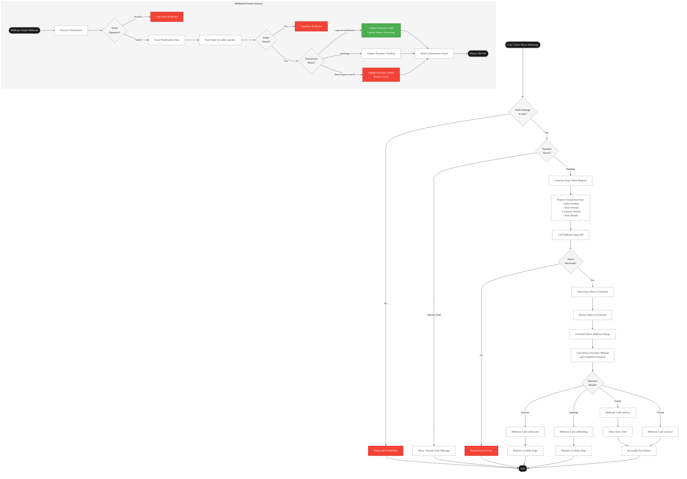
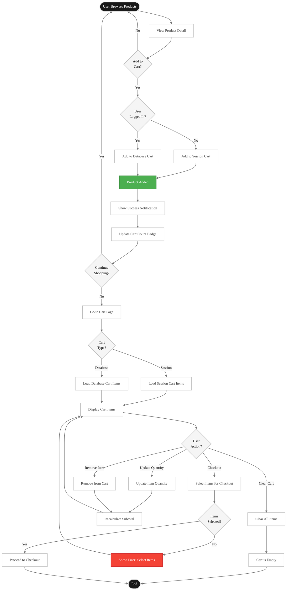
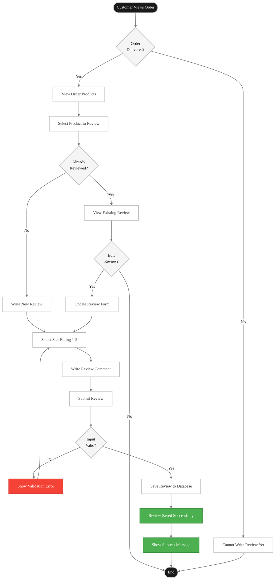
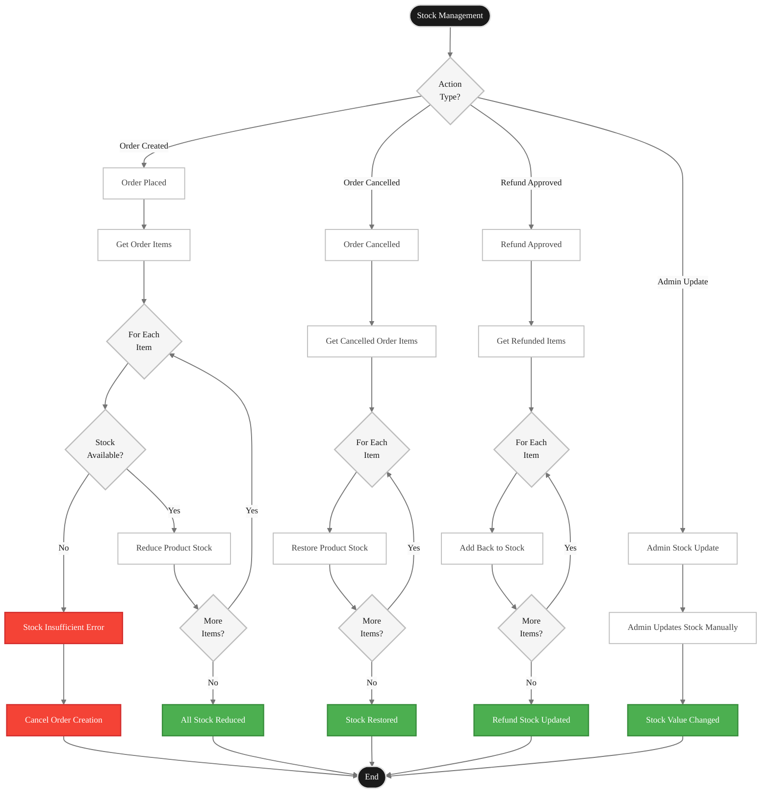

# TeoriWarna E-Commerce - System Flowcharts

## 1. Customer Order Flow (Complete Journey)

```mermaid
%%{init: {'theme':'base', 'themeVariables': { 'primaryColor':'#ffffff','primaryTextColor':'#1a1a1a','primaryBorderColor':'#e0e0e0','lineColor':'#757575','secondaryColor':'#fafafa','tertiaryColor':'#f5f5f5','background':'#ffffff','fontSize':'14px','fontFamily':'Georgia, serif'}}}%%

flowchart TD
    Start([Customer Visits Site]) --> Browse[Browse Products]
    Browse --> ProductDetail{View Product<br/>Detail?}

    ProductDetail -->|Yes| ViewProduct[View Product Page]
    ProductDetail -->|No| Browse

    ViewProduct --> AddCart{Add to Cart<br/>or Buy Now?}

    AddCart -->|Add to Cart| CartAdded[Product Added to Cart]
    AddCart -->|Buy Now| DirectCheckout[Go to Checkout]

    CartAdded --> ContinueShopping{Continue<br/>Shopping?}
    ContinueShopping -->|Yes| Browse
    ContinueShopping -->|No| ViewCart[View Shopping Cart]

    ViewCart --> SelectItems[Select Items for Checkout]
    SelectItems --> Checkout[Proceed to Checkout]

    DirectCheckout --> CheckAuth{User<br/>Logged In?}
    Checkout --> CheckAuth

    CheckAuth -->|No| Login[Login/Register]
    CheckAuth -->|Yes| FillShipping[Fill Shipping Information]

    Login --> FillShipping

    FillShipping --> SelectShipping[Select Shipping Method]
    SelectShipping --> SelectPayment[Select Payment Method]
    SelectPayment --> ReviewOrder[Review Order Summary]

    ReviewOrder --> ConfirmOrder{Confirm<br/>Order?}
    ConfirmOrder -->|No| FillShipping
    ConfirmOrder -->|Yes| CreateOrder[Create Order]

    CreateOrder --> CheckStock{Stock<br/>Available?}
    CheckStock -->|No| StockError[Stock Insufficient Error]
    StockError --> ViewCart

    CheckStock -->|Yes| OrderCreated[Order Created - Status: Pending]
    OrderCreated --> PaymentPage[Redirect to Payment Page]

    PaymentPage --> PaymentMethod{Payment<br/>Method?}

    PaymentMethod -->|Midtrans| OpenSnap[Open Midtrans Snap]
    PaymentMethod -->|COD| CODConfirm[COD Confirmed]

    OpenSnap --> SelectPaymentType[Select Payment Type:<br/>Bank Transfer/E-Wallet/<br/>Credit Card/Store]

    SelectPaymentType --> MakePayment[Complete Payment]

    MakePayment --> PaymentSuccess{Payment<br/>Success?}

    PaymentSuccess -->|Yes| WebhookReceived[Midtrans Sends Webhook]
    PaymentSuccess -->|No| PaymentFailed[Payment Failed]

    WebhookReceived --> UpdatePayment[Update Payment Status: Paid]
    UpdatePayment --> UpdateOrder[Update Order Status: Processing]

    CODConfirm --> UpdateOrder

    PaymentFailed --> RetryPayment{Retry<br/>Payment?}
    RetryPayment -->|Yes| PaymentPage
    RetryPayment -->|No| CancelOrder[Cancel Order]

    UpdateOrder --> AdminProcess[Admin Processes Order]
    AdminProcess --> PackOrder[Pack Order]
    PackOrder --> ShipOrder[Ship Order - Status: Shipped]
    ShipOrder --> AddTracking[Add Tracking Number]

    AddTracking --> CustomerNotified[Customer Notified]
    CustomerNotified --> WaitDelivery[Wait for Delivery]

    WaitDelivery --> Delivered{Order<br/>Delivered?}
    Delivered -->|Yes| ConfirmReceived[Customer Confirms Receipt]
    Delivered -->|No| WaitDelivery

    ConfirmReceived --> OrderCompleted[Order Status: Delivered]

    OrderCompleted --> ReviewProduct{Write<br/>Review?}
    ReviewProduct -->|Yes| WriteReview[Submit Product Review]
    ReviewProduct -->|No| End([Order Complete])

    WriteReview --> End
    CancelOrder --> End

    classDef startEnd fill:#1a1a1a,stroke:#e0e0e0,stroke-width:2px,color:#ffffff
    classDef success fill:#4caf50,stroke:#388e3c,stroke-width:2px,color:#ffffff
    classDef warning fill:#ff9800,stroke:#f57c00,stroke-width:2px,color:#ffffff
    classDef error fill:#f44336,stroke:#d32f2f,stroke-width:2px,color:#ffffff
    classDef process fill:#ffffff,stroke:#bdbdbd,stroke-width:1.5px,color:#424242
    classDef decision fill:#f5f5f5,stroke:#bdbdbd,stroke-width:2px,color:#1a1a1a
    
    class Start,End startEnd
    class OrderCreated,UpdateOrder success
    class PaymentPage warning
    class PaymentFailed,CancelOrder,StockError error
    class Browse,ViewProduct,CartAdded,ViewCart,SelectItems,DirectCheckout,Login,FillShipping,SelectShipping,SelectPayment,ReviewOrder,CreateOrder,OpenSnap,SelectPaymentType,MakePayment,WebhookReceived,UpdatePayment,CODConfirm,AdminProcess,PackOrder,ShipOrder,AddTracking,CustomerNotified,WaitDelivery,ConfirmReceived,OrderCompleted,WriteReview process
    class ProductDetail,AddCart,ContinueShopping,CheckAuth,ConfirmOrder,CheckStock,PaymentMethod,PaymentSuccess,RetryPayment,Delivered,ReviewProduct decision
    
    linkStyle default stroke:#757575,stroke-width:1.5px
```

---

## 2. Payment Integration Flow (Midtrans Snap)

---

## 3. Admin Order Management Flow

```mermaid
%%{init: {'theme':'base', 'themeVariables': { 'primaryColor':'#ffffff','primaryTextColor':'#1a1a1a','primaryBorderColor':'#e0e0e0','lineColor':'#757575','secondaryColor':'#fafafa','tertiaryColor':'#f5f5f5','background':'#ffffff','fontSize':'14px','fontFamily':'Georgia, serif'}}}%%

flowchart TD
    Start([Admin Access Orders]) --> ViewOrders[View Orders List]

    ViewOrders --> FilterOrders{Filter by<br/>Status?}
    FilterOrders -->|Yes| ApplyFilter[Apply Status Filter]
    FilterOrders -->|No| AllOrders[Show All Orders]

    ApplyFilter --> AllOrders
    AllOrders --> SelectOrder[Select Order to Manage]

    SelectOrder --> ViewOrderDetail[View Order Details]
    ViewOrderDetail --> CheckStatus{Current<br/>Status?}

    CheckStatus -->|Pending| WaitingPayment[Waiting for Payment]
    CheckStatus -->|Processing| ProcessOrder[Process Order]
    CheckStatus -->|Shipped| TrackShipment[Track Shipment]
    CheckStatus -->|Delivered| OrderComplete[Order Completed]
    CheckStatus -->|Cancelled| CancelledOrder[View Cancellation]

    WaitingPayment --> CheckPayment{Payment<br/>Received?}
    CheckPayment -->|Yes| UpdateProcessing[Update to Processing]
    CheckPayment -->|No| WaitingPayment

    UpdateProcessing --> ProcessOrder

    ProcessOrder --> PrepareItems[Prepare Items]
    PrepareItems --> PackItems[Pack Items]
    PackItems --> SelectCourier[Select Courier]
    SelectCourier --> GenerateShipping[Generate Shipping Label]

    GenerateShipping --> UpdateShipped[Update Status to Shipped]
    UpdateShipped --> AddTrackingNumber[Add Tracking Number]
    AddTrackingNumber --> NotifyCustomer[Notify Customer via Email]

    NotifyCustomer --> TrackShipment

    TrackShipment --> WaitDelivery{Delivered?}
    WaitDelivery -->|No| TrackShipment
    WaitDelivery -->|Yes| CustomerConfirm{Customer<br/>Confirmed?}

    CustomerConfirm -->|Yes| AutoComplete[Auto Update to Delivered]
    CustomerConfirm -->|No| WaitDelivery

    AutoComplete --> OrderComplete

    OrderComplete --> CheckRefund{Refund<br/>Requested?}
    CheckRefund -->|Yes| ProcessRefund[Review Refund Request]
    CheckRefund -->|No| End([End])

    ProcessRefund --> ApproveRefund{Approve<br/>Refund?}
    ApproveRefund -->|Yes| RefundApproved[Approve & Process Refund]
    ApproveRefund -->|No| RefundRejected[Reject with Reason]

    RefundApproved --> RestoreStock[Restore Product Stock]
    RestoreStock --> ProcessRefundPayment[Process Refund Payment]
    ProcessRefundPayment --> End

    RefundRejected --> End
    CancelledOrder --> End

    classDef startEnd fill:#1a1a1a,stroke:#e0e0e0,stroke-width:2px,color:#ffffff
    classDef success fill:#4caf50,stroke:#388e3c,stroke-width:2px,color:#ffffff
    classDef warning fill:#ff9800,stroke:#f57c00,stroke-width:2px,color:#ffffff
    classDef process fill:#ffffff,stroke:#bdbdbd,stroke-width:1.5px,color:#424242
    classDef decision fill:#f5f5f5,stroke:#bdbdbd,stroke-width:2px,color:#1a1a1a
    
    class Start,End startEnd
    class UpdateProcessing,UpdateShipped,AutoComplete,RefundApproved warning
    class OrderComplete success
    class ViewOrders,ApplyFilter,AllOrders,SelectOrder,ViewOrderDetail,WaitingPayment,ProcessOrder,PrepareItems,PackItems,SelectCourier,GenerateShipping,AddTrackingNumber,NotifyCustomer,TrackShipment,ProcessRefund,RestoreStock,ProcessRefundPayment,RefundRejected,CancelledOrder process
    class FilterOrders,CheckStatus,CheckPayment,WaitDelivery,CustomerConfirm,CheckRefund,ApproveRefund decision
    
    linkStyle default stroke:#757575,stroke-width:1.5px
```

---

## 4. Cart Management Flow

---

## 5. Product Review Flow

---

## 6. Stock Management Flow

---

**Last Updated:** January 4, 2026  
**System Version:** 1.0.0