# TeoriWarna E-Commerce - Use Case Diagram

## System Use Case Diagram

```mermaid
graph TB
    subgraph "TeoriWarna E-Commerce System"
        subgraph "Customer Use Cases"
            UC1[Browse Products]
            UC2[Search Products]
            UC3[View Product Details]
            UC4[Add to Cart]
            UC5[Manage Cart]
            UC6[Checkout]
            UC7[Make Payment]
            UC8[View Orders]
            UC9[Track Order]
            UC10[Confirm Delivery]
            UC11[Write Review]
            UC12[Request Refund]
            UC13[Manage Profile]
            UC14[Manage Addresses]
        end

        subgraph "Admin Use Cases"
            UC15[Manage Products]
            UC16[Manage Categories]
            UC17[Manage Orders]
            UC18[Process Payments]
            UC19[Manage Shipping]
            UC20[Process Refunds]
            UC21[Manage Users]
            UC22[View Analytics]
            UC23[Manage Reviews]
            UC24[Configure Settings]
        end

        subgraph "System Use Cases"
            UC25[Send Email Notifications]
            UC26[Process Midtrans Webhook]
            UC27[Calculate Shipping]
            UC28[Manage Stock]
            UC29[Generate Reports]
        end
    end

    Customer([Customer/User])
    Admin([Admin])
    Midtrans([Midtrans Gateway])
    EmailSystem([Email System])

    Customer -.-> UC1
    Customer -.-> UC2
    Customer -.-> UC3
    Customer -.-> UC4
    Customer -.-> UC5
    Customer -.-> UC6
    Customer -.-> UC7
    Customer -.-> UC8
    Customer -.-> UC9
    Customer -.-> UC10
    Customer -.-> UC11
    Customer -.-> UC12
    Customer -.-> UC13
    Customer -.-> UC14

    Admin -.-> UC15
    Admin -.-> UC16
    Admin -.-> UC17
    Admin -.-> UC18
    Admin -.-> UC19
    Admin -.-> UC20
    Admin -.-> UC21
    Admin -.-> UC22
    Admin -.-> UC23
    Admin -.-> UC24

    UC7 --> Midtrans
    Midtrans --> UC26

    UC25 --> EmailSystem

    UC6 -.->|includes| UC27
    UC6 -.->|includes| UC28
    UC7 -.->|includes| UC25
    UC17 -.->|includes| UC25
    UC20 -.->|includes| UC28

    style Customer fill:#e1f5ff
    style Admin fill:#ffe1e1
    style Midtrans fill:#fff4e1
    style EmailSystem fill:#f0ffe1
```

---

## Use Case Descriptions

### Customer Use Cases

#### UC1: Browse Products
**Actor:** Customer
**Description:** Customer can browse all available products in the catalog
**Precondition:** None
**Postcondition:** Products displayed to customer

#### UC2: Search Products
**Actor:** Customer
**Description:** Customer can search products by name, category, or price range
**Precondition:** None
**Postcondition:** Filtered products displayed

#### UC3: View Product Details
**Actor:** Customer
**Description:** Customer can view detailed information about a product
**Precondition:** Product exists and is active
**Postcondition:** Product details, images, and reviews displayed

#### UC4: Add to Cart
**Actor:** Customer
**Description:** Customer can add products to shopping cart
**Precondition:** Product has sufficient stock
**Postcondition:** Product added to cart (session or database)

#### UC5: Manage Cart
**Actor:** Customer
**Description:** Customer can view, update quantity, or remove items from cart
**Precondition:** Cart has items
**Postcondition:** Cart updated according to customer action

#### UC6: Checkout
**Actor:** Customer
**Description:** Customer proceeds to checkout with selected items
**Precondition:** Customer is logged in, cart has items
**Postcondition:** Order created with shipping details
**Includes:** UC27 (Calculate Shipping), UC28 (Manage Stock)

#### UC7: Make Payment
**Actor:** Customer
**Description:** Customer completes payment for order
**Precondition:** Order exists with pending payment
**Postcondition:** Payment processed, order status updated
**Includes:** UC25 (Send Email)
**Extends to:** Midtrans Gateway

#### UC8: View Orders
**Actor:** Customer
**Description:** Customer can view order history
**Precondition:** Customer is logged in
**Postcondition:** Order list displayed

#### UC9: Track Order
**Actor:** Customer
**Description:** Customer can track order status and shipping
**Precondition:** Order exists
**Postcondition:** Order status and tracking info displayed

#### UC10: Confirm Delivery
**Actor:** Customer
**Description:** Customer confirms receipt of delivered order
**Precondition:** Order status is "shipped"
**Postcondition:** Order status updated to "delivered"

#### UC11: Write Review
**Actor:** Customer
**Description:** Customer writes product review and rating
**Precondition:** Customer has received the product
**Postcondition:** Review saved and displayed on product page

#### UC12: Request Refund
**Actor:** Customer
**Description:** Customer requests refund for delivered order
**Precondition:** Order is delivered
**Postcondition:** Refund request created with pending status

#### UC13: Manage Profile
**Actor:** Customer
**Description:** Customer can update profile information
**Precondition:** Customer is logged in
**Postcondition:** Profile updated

#### UC14: Manage Addresses
**Actor:** Customer
**Description:** Customer can add, edit, or delete shipping addresses
**Precondition:** Customer is logged in
**Postcondition:** Address list updated

---

### Admin Use Cases

#### UC15: Manage Products
**Actor:** Admin
**Description:** Admin can create, update, or delete products
**Precondition:** Admin is authenticated
**Postcondition:** Product catalog updated

#### UC16: Manage Categories
**Actor:** Admin
**Description:** Admin can create, update, or delete product categories
**Precondition:** Admin is authenticated
**Postcondition:** Category list updated

#### UC17: Manage Orders
**Actor:** Admin
**Description:** Admin can view and update order status
**Precondition:** Admin is authenticated
**Postcondition:** Order status updated
**Includes:** UC25 (Send Email)

#### UC18: Process Payments
**Actor:** Admin
**Description:** Admin can view payment status and verify manual payments
**Precondition:** Admin is authenticated
**Postcondition:** Payment status verified

#### UC19: Manage Shipping
**Actor:** Admin
**Description:** Admin can update shipping status and add tracking numbers
**Precondition:** Order payment is confirmed
**Postcondition:** Shipping info updated

#### UC20: Process Refunds
**Actor:** Admin
**Description:** Admin can approve or reject refund requests
**Precondition:** Refund request exists
**Postcondition:** Refund processed or rejected
**Includes:** UC28 (Manage Stock)

#### UC21: Manage Users
**Actor:** Admin
**Description:** Admin can view and manage user accounts
**Precondition:** Admin is authenticated
**Postcondition:** User data updated

#### UC22: View Analytics
**Actor:** Admin
**Description:** Admin can view sales analytics and reports
**Precondition:** Admin is authenticated
**Postcondition:** Analytics data displayed

#### UC23: Manage Reviews
**Actor:** Admin
**Description:** Admin can moderate product reviews
**Precondition:** Admin is authenticated
**Postcondition:** Reviews moderated

#### UC24: Configure Settings
**Actor:** Admin
**Description:** Admin can configure store settings
**Precondition:** Admin is authenticated
**Postcondition:** Store settings updated

---

### System Use Cases

#### UC25: Send Email Notifications
**Actor:** System
**Description:** System sends automated email notifications
**Trigger:** Order created, payment received, order shipped
**Extends to:** Email System

#### UC26: Process Midtrans Webhook
**Actor:** System
**Description:** System receives and processes Midtrans payment webhooks
**Trigger:** Midtrans sends payment notification
**Postcondition:** Payment and order status updated

#### UC27: Calculate Shipping
**Actor:** System
**Description:** System calculates shipping cost based on method
**Trigger:** Checkout process
**Postcondition:** Shipping cost added to order total

#### UC28: Manage Stock
**Actor:** System
**Description:** System automatically manages product stock
**Trigger:** Order created, cancelled, or refunded
**Postcondition:** Product stock updated

#### UC29: Generate Reports
**Actor:** System
**Description:** System generates sales and analytics reports
**Trigger:** Admin requests report
**Postcondition:** Report data generated

---

## Actor Descriptions

### Customer/User
- **Type:** Primary Actor
- **Description:** End users who browse and purchase products
- **Permissions:**
  - Browse catalog
  - Manage cart
  - Place orders
  - Make payments
  - Write reviews
  - Request refunds

### Admin
- **Type:** Primary Actor
- **Description:** System administrators who manage the store
- **Permissions:**
  - Full CRUD on products, categories
  - Order management
  - Payment verification
  - Refund processing
  - User management
  - Analytics access
  - System configuration

### Midtrans Gateway
- **Type:** External System
- **Description:** Third-party payment gateway service
- **Interactions:**
  - Processes payments
  - Sends webhooks for payment status
  - Provides payment methods

### Email System
- **Type:** External System
- **Description:** Email delivery service
- **Interactions:**
  - Sends order confirmations
  - Sends shipping notifications
  - Sends admin notifications

---

## Use Case Relationships

### Includes Relationships
- **UC6 (Checkout)** includes **UC27 (Calculate Shipping)**
- **UC6 (Checkout)** includes **UC28 (Manage Stock)**
- **UC7 (Make Payment)** includes **UC25 (Send Email)**
- **UC17 (Manage Orders)** includes **UC25 (Send Email)**
- **UC20 (Process Refunds)** includes **UC28 (Manage Stock)**

### Extends Relationships
- **UC7 (Make Payment)** extends to **Midtrans Gateway**
- **UC26 (Process Webhook)** extends from **Midtrans Gateway**
- **UC25 (Send Email)** extends to **Email System**

---

## Summary Statistics

### Total Use Cases: 29
- **Customer Use Cases:** 14
- **Admin Use Cases:** 10
- **System Use Cases:** 5

### Actors: 4
- **Primary Actors:** 2 (Customer, Admin)
- **External Systems:** 2 (Midtrans, Email)

### Relationships:
- **Includes:** 5 relationships
- **Extends:** 3 relationships
- **Direct Interactions:** 21 relationships

---

**Last Updated:** January 4, 2026
**System Version:** 1.0.0
