# TeoriWarna E-Commerce - Use Case Diagram

## System Use Cases

```mermaid
%%{init: {'theme':'base', 'themeVariables': { 'primaryColor':'#ffffff','primaryTextColor':'#1a1a1a','primaryBorderColor':'#e0e0e0','lineColor':'#757575','secondaryColor':'#fafafa','tertiaryColor':'#f5f5f5','background':'#ffffff','fontSize':'14px','fontFamily':'Georgia, serif'}}}%%

flowchart LR
    Guest(["Guest User"])
    User(["Registered User"])
    Admin(["Administrator"])

    subgraph System["TeoriWarna E-Commerce System"]
        direction TB

        subgraph GuestUC["Guest Features"]
            UC1["Browse Products"]
            UC2["Search Products"]
            UC3["View Product Details"]
            UC4["Register Account"]
        end

        subgraph UserUC["User Features"]
            UC5["Add to Cart"]
            UC6["Manage Cart"]
            UC7["Checkout"]
            UC8["Make Payment"]
            UC9["View Orders"]
            UC10["Track Order"]
            UC11["Confirm Delivery"]
            UC12["Write Review"]
            UC13["Request Refund"]
            UC14["Manage Profile"]
        end

        subgraph AdminUC["Admin Features"]
            UC15["Manage Products"]
            UC16["Manage Categories"]
            UC17["Manage Orders"]
            UC18["Update Order Status"]
            UC19["Process Payments"]
            UC20["Manage Shipping"]
            UC21["Process Refunds"]
            UC22["Manage Users"]
            UC23["View Analytics"]
        end
    end

    Guest --> UC1
    Guest --> UC2
    Guest --> UC3
    Guest --> UC4

    User --> UC1
    User --> UC2
    User --> UC3
    User --> UC5
    User --> UC6
    User --> UC7
    User --> UC8
    User --> UC9
    User --> UC10
    User --> UC11
    User --> UC12
    User --> UC13
    User --> UC14

    Admin --> UC15
    Admin --> UC16
    Admin --> UC17
    Admin --> UC18
    Admin --> UC19
    Admin --> UC20
    Admin --> UC21
    Admin --> UC22
    Admin --> UC23

    classDef actorGuest fill:#ffffff,stroke:#bdbdbd,stroke-width:2px,color:#424242
    classDef actorUser fill:#1a1a1a,stroke:#e0e0e0,stroke-width:2px,color:#ffffff
    classDef actorAdmin fill:#e53935,stroke:#c62828,stroke-width:2px,color:#ffffff
    classDef systemBox fill:#fafafa,stroke:#e0e0e0,stroke-width:2px,color:#1a1a1a
    classDef featureBox fill:#ffffff,stroke:#e0e0e0,stroke-width:1.5px,color:#1a1a1a
    classDef useCase fill:#ffffff,stroke:#bdbdbd,stroke-width:1.5px,color:#424242
    
    class Guest actorGuest
    class User actorUser
    class Admin actorAdmin
    class System systemBox
    class GuestUC,UserUC,AdminUC featureBox
    class UC1,UC2,UC3,UC4,UC5,UC6,UC7,UC8,UC9,UC10,UC11,UC12,UC13,UC14,UC15,UC16,UC17,UC18,UC19,UC20,UC21,UC22,UC23 useCase
    
    linkStyle default stroke:#757575,stroke-width:1.5px
```

---

## Actor Descriptions

**Guest User** - Visitors who can browse products and register for an account. Limited to read-only operations on product catalog.

**Registered User** - Authenticated customers who can shop, place orders, and manage their account. Full access to shopping and order management features.

**Administrator** - System administrators with full control over products, orders, users, and system configuration.

---

## Use Case Summary

### Guest Features (4)
Browse and search products, view details, register account

### User Features (10)
Shopping cart management, checkout process, payment, order tracking, reviews, refunds, profile management

### Admin Features (9)
Product catalog management, order processing, payment verification, shipping coordination, refund handling, user management, analytics

---

## Feature Breakdown

### Product Discovery
Guest users and registered users can browse the product catalog, search for specific items, and view detailed product information including images, descriptions, pricing, and customer reviews.

### Shopping & Checkout
Registered users can add products to cart, manage quantities, proceed through checkout with shipping information, and complete payment via multiple methods (bank transfer, e-wallet, or cash on delivery).

### Order Management
Users can view order history, track shipments in real-time, confirm delivery upon receipt, and request refunds if needed. Administrators handle order processing, status updates, and shipping coordination.

### Reviews & Feedback
After delivery confirmation, users can write product reviews with ratings and comments, helping other customers make informed decisions.

### Administrative Control
Administrators manage the complete system including product catalog, categories, order fulfillment, payment verification, refund processing, user accounts, and business analytics.

---

**System:** TeoriWarna E-Commerce  
**Total Use Cases:** 23  
**Total Actors:** 3  
**Last Updated:** January 4, 2026