# TeoriWarna E-Commerce - Use Case Diagram

## System Use Case Diagram

```mermaid
flowchart TB
    Guest(["Guest User"])
    User(["User"])
    Admin(["Admin"])

    subgraph System["TeoriWarna E-Commerce System"]
        direction TB

        subgraph GuestUC["Guest Features"]
            UC1["Browse Products"]
            UC2["Search Products"]
            UC3["View Product Details"]
            UC4["Register Account"]
        end

        subgraph UserUC["User Features"]
            UC5["Add to Cart"]
            UC6["Manage Cart"]
            UC7["Checkout"]
            UC8["Make Payment"]
            UC9["View Orders"]
            UC10["Track Order"]
            UC11["Confirm Delivery"]
            UC12["Write Review"]
            UC13["Request Refund"]
            UC14["Manage Profile"]
        end

        subgraph AdminUC["Admin Features"]
            UC15["Manage Products"]
            UC16["Manage Categories"]
            UC17["Manage Orders"]
            UC18["Update Order Status"]
            UC19["Process Payments"]
            UC20["Manage Shipping"]
            UC21["Process Refunds"]
            UC22["Manage Users"]
            UC23["View Analytics"]
        end
    end

    Guest --> UC1
    Guest --> UC2
    Guest --> UC3
    Guest --> UC4

    User --> UC1
    User --> UC2
    User --> UC3
    User --> UC5
    User --> UC6
    User --> UC7
    User --> UC8
    User --> UC9
    User --> UC10
    User --> UC11
    User --> UC12
    User --> UC13
    User --> UC14

    Admin --> UC15
    Admin --> UC16
    Admin --> UC17
    Admin --> UC18
    Admin --> UC19
    Admin --> UC20
    Admin --> UC21
    Admin --> UC22
    Admin --> UC23
```

---

## Use Case Descriptions

### Guest User Use Cases

#### UC1: Browse Products
**Actor:** Guest User, User
**Description:** Browse all products in the catalog grouped by categories
**Flow:**
1. Guest visits catalog page
2. System displays products grouped by category
3. Guest can scroll through different categories
4. Each product shows image, name, and price

#### UC2: Search Products
**Actor:** Guest User, User
**Description:** Search and filter products
**Flow:**
1. Guest enters search keyword
2. Guest can filter by category or price range
3. System displays filtered results
4. Guest can sort by price (low to high, high to low)

#### UC3: View Product Details
**Actor:** Guest User, User
**Description:** View detailed product information
**Flow:**
1. Guest clicks on a product
2. System displays product details page
3. Shows product images, description, price, stock
4. Shows customer reviews and ratings
5. Guest sees "Login to Purchase" button

#### UC4: Register Account
**Actor:** Guest User
**Description:** Create a new user account
**Flow:**
1. Guest clicks "Register"
2. Guest fills in name, email, password, phone
3. System validates input
4. System creates account
5. Guest becomes User and is logged in

---

### User Use Cases

#### UC5: Add to Cart
**Actor:** User
**Description:** Add products to shopping cart
**Flow:**
1. User views product detail
2. User clicks "Add to Cart"
3. System checks stock availability
4. System adds product to database cart
5. Cart count badge updates

#### UC6: Manage Cart
**Actor:** User
**Description:** View and modify cart items
**Flow:**
1. User opens cart page
2. System displays all cart items with current prices
3. User can update quantity or remove items
4. System recalculates subtotal
5. User can select items for checkout

#### UC7: Checkout
**Actor:** User
**Description:** Process order checkout
**Flow:**
1. User selects items and clicks checkout
2. User fills shipping address
3. User selects shipping method (Regular/Express/Same Day)
4. System calculates shipping cost
5. System shows order summary
6. User confirms order
7. System creates order and reduces stock

#### UC8: Make Payment
**Actor:** User
**Description:** Complete payment for order
**Flow:**
1. User clicks "Pay Now" on order page
2. System generates Midtrans Snap token
3. Midtrans payment popup opens
4. User selects payment method (Bank Transfer/E-Wallet/Credit Card)
5. User completes payment
6. Midtrans sends webhook to system
7. System updates payment and order status
8. System sends confirmation email

#### UC9: View Orders
**Actor:** User
**Description:** View order history and details
**Flow:**
1. User opens orders page
2. System displays all orders
3. User can filter by status
4. User clicks order to view details
5. Shows items, shipping info, payment status

#### UC10: Track Order
**Actor:** User
**Description:** Track order delivery status
**Flow:**
1. User views order detail
2. System shows current status (Pending/Processing/Shipped/Delivered)
3. If shipped, system shows tracking number and courier
4. User can view status timeline

#### UC11: Confirm Delivery
**Actor:** User
**Description:** Confirm order has been received
**Flow:**
1. Order status is "Shipped"
2. User receives the package
3. User clicks "Confirm Delivery"
4. System updates order status to "Delivered"

#### UC12: Write Review
**Actor:** User
**Description:** Write product review and rating
**Flow:**
1. Order status is "Delivered"
2. User clicks "Write Review"
3. User selects star rating (1-5)
4. User writes review comment
5. System saves review
6. Review appears on product page

#### UC13: Request Refund
**Actor:** User
**Description:** Request refund for delivered order
**Flow:**
1. Order status is "Delivered"
2. User clicks "Request Refund"
3. User enters refund reason
4. User selects refund method (Bank Transfer/E-Wallet)
5. User provides bank/e-wallet details
6. System creates refund request with "Pending" status

#### UC14: Manage Profile
**Actor:** User
**Description:** Update account information
**Flow:**
1. User opens profile page
2. User can update name, email, phone, password
3. User can add/edit/delete shipping addresses
4. User can set default address
5. System saves changes

---

### Admin Use Cases

#### UC15: Manage Products
**Actor:** Admin
**Description:** CRUD operations on products
**Flow:**
1. Admin opens product management (Filament)
2. Admin can create new product
3. Admin can upload multiple product images
4. Admin can edit product details (name, price, stock, description)
5. Admin can set product status (Active/Inactive)
6. Admin can delete products

#### UC16: Manage Categories
**Actor:** Admin
**Description:** CRUD operations on categories
**Flow:**
1. Admin opens category management
2. Admin can create new category
3. Admin can set category styling (background color, text color, style type)
4. Admin can activate/deactivate categories
5. Admin can delete categories

#### UC17: Manage Orders
**Actor:** Admin
**Description:** View and manage all orders
**Flow:**
1. Admin opens order management
2. System displays all orders with filters
3. Admin can filter by status
4. Admin can view order details
5. Admin can see customer info and items

#### UC18: Update Order Status
**Actor:** Admin
**Description:** Change order status through fulfillment process
**Flow:**
1. Admin views order with "Processing" status
2. Admin prepares and packs items
3. Admin updates status to "Shipped"
4. Admin adds tracking number and courier
5. System sends shipping notification email to customer

#### UC19: Process Payments
**Actor:** Admin
**Description:** Verify and manage payments
**Flow:**
1. Admin views payment list
2. Admin can see payment status (Pending/Paid/Failed)
3. Admin can view Midtrans transaction details
4. Admin can verify manual payments (if needed)

#### UC20: Manage Shipping
**Actor:** Admin
**Description:** Handle shipping and delivery
**Flow:**
1. Admin views orders ready to ship
2. Admin enters tracking number
3. Admin selects courier service
4. Admin updates status to "Shipped"
5. Customer receives notification

#### UC21: Process Refunds
**Actor:** Admin
**Description:** Handle refund requests
**Flow:**
1. Admin views refund requests
2. Admin reviews refund reason and order details
3. Admin can approve or reject refund
4. If approved: system restores stock, processes refund payment
5. If rejected: admin enters rejection reason
6. System notifies customer

#### UC22: Manage Users
**Actor:** Admin
**Description:** Manage user accounts
**Flow:**
1. Admin opens user management
2. Admin can view all users
3. Admin can edit user information
4. Admin can ban/unban users
5. Admin can change user roles (User/Admin)

#### UC23: View Analytics
**Actor:** Admin
**Description:** View sales reports and statistics
**Flow:**
1. Admin opens dashboard
2. System displays sales chart (daily/weekly/monthly)
3. Shows total revenue, orders, products sold
4. Admin can generate custom reports

---

## Actor Descriptions

### 🌐 Guest User
**Unauthenticated Visitor** - Anonymous users browsing the site
- Can browse and search products
- Can view product details and reviews
- Must register to make purchases
- Session-based cart (if implemented)

### 👤 User
**Registered Customer** - Authenticated customers
- All guest user capabilities
- Can add products to cart (database)
- Can checkout and make payments
- Can track orders and write reviews
- Can request refunds

### 👨‍💼 Admin
**Administrator** - Store managers and staff
- Access to Filament admin panel
- Full CRUD on products and categories
- Manages orders from payment to delivery
- Processes refunds and manages users
- Views analytics and reports

---

## Summary

**Total Use Cases:** 23
- Guest User: 4 use cases
- User: 14 use cases (includes guest features)
- Admin: 9 use cases

**Actors:** 3
- Guest User (unauthenticated)
- User (authenticated customer)
- Admin (staff/administrator)

**External Integrations:**
- Midtrans Payment Gateway (Snap API)
- Email Notification Service
- Automatic Stock Management

---

**Last Updated:** January 4, 2026
**System Version:** 1.0.0
